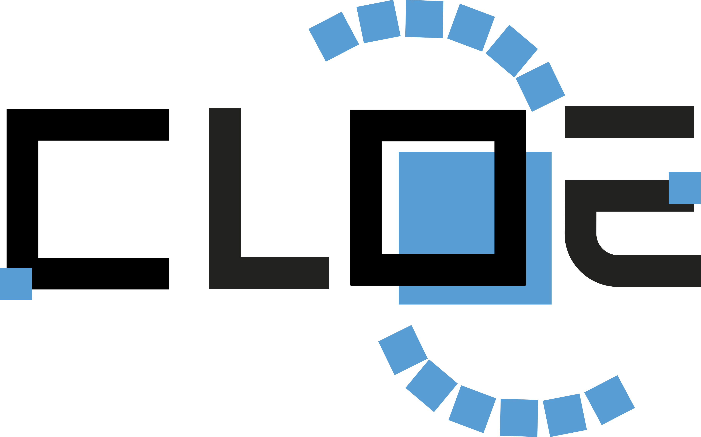

[](https://codecov.io/gh/testarnyttnamn/testnamemaster)

# CLOE: Cosmology Likelihood for Observables in Euclid



This repository allows the user to obtain model predictions and cosmological parameter constraints for synthetic and real Euclid data. It is developed by the Inter-Science Taskforce for Likelihood (IST:L) within the Euclid Consortium, in close collaboration with all of the Euclid Science Working Groups, Organisational Units, and the Inter-Science Taskforce for Nonlinear effects (IST:NL).

In the latest version of CLOE, the cosmological observables are defined by the following set:

- Cosmic shear tomography
- Photometric galaxy clustering tomography
- Photometric galaxy-galaxy lensing tomography
- Spectroscopic / Redshift-space galaxy clustering
- Cross-correlations with the cosmic microwave background
- Galaxy cluster probes

CLOE allows the user to consider these probes either separately or in a self-consistent combined analysis.
It is also possible to analyze the Euclid data alongside other external datasets within the
Cobaya and CosmoSIS platforms.

Further documentation is found [here](http://pf-ist-likelihood.pages.euclid-sgs.uk/likelihood-implementation/index.html)

## Integration of CLOE with other codes

CLOE allows the user to obtain the linear matter power spectrum from either of the [CAMB](https://camb.readthedocs.io/en/latest/) and [CLASS](https://lesgourg.github.io/class_public/class.html) Boltzmann codes.

In order to obtain cosmological parameter constraints, CLOE reads in the redshift distributions and computes the theoretical predictions of the Euclid observables, which are used together with the data and covariance to obtain the likelihood. The likelihood is then evaluated across the parameter space using one of the samplers of [Cobaya](https://cobaya.readthedocs.io/en/latest/) or [CosmoSIS](https://cosmosis.readthedocs.io/en/latest/) to obtain the posterior probability.

## Installation

**git clone CLOE**

```shell
git clone https://gitlab.euclid-sgs.uk/pf-ist-likelihood/likelihood-implementation.git
```
We provide below different options for installation: [with conda](#conda), or [with pip](#pip), or [with docker](#docker). In the [troubleshooting](#troubles) section you can find a list of  suggestions to solve issues that we encountered so far, which may help you with the installation.

### 1. Installation with a conda environment <a name="conda"></a>

**Option a) (recommended)**

Use the `environment.yml` that we provide, which includes all the required dependencies with fixed versions that have been tested with CLOE:

```shell
conda env create -f environment.yml
conda activate cloe
pip install .
```

**Option b)** 

If our environment does not work on your cluster (ex. it gets stuck), but you have anaconda, we recommend to create your own environment as follows: 

```shell
conda create -n cloe python=3.9 
source activate cloe
```

Then, install all the following packages, in this order either with pip or with conda (depending on what works on your cluster):

```shell
pip install astropy
pip install jupyter
pip install matplotlib
conda install mpi4py
conda install numpy
conda install scipy
conda install seaborn
conda install tensorflow
pip install fast-pt
pip install camb
pip install gsl
pip install cobaya
pip install baccoemu
pip install euclidemu2
pip install pytest
pip install pytest-cov
pip install pytest-pycodestyle
pip install pytest-pydocstyle
pip install sphinx
pip install sphinx-rtd-theme
pip install numpydoc
```

### 2. Installation with pip <a name="pip"></a>

If you do not have anaconda, you would have to install manually on your cluster all the packages listed in Option b) written above, with pip.

### 3. CLOE Docker image <a name="docker"></a>

The CLOE Docker image comes with CLOE and all dependencies pre-installed. In order to use this image you will need to have [Docker](https://www.docker.com/) installed on the relevant machine.

#### Pull the Docker Image

Log into the Euclid GitLab container registry,

```shell
docker login gitlab.euclid-sgs.uk:4567
```

pull the latest CLOE Docker image

```shell
docker pull gitlab.euclid-sgs.uk:4567/pf-ist-likelihood/likelihood-implementation/cloe
```

and tag an alias called `cloe` to avoid writing the full image name for every command.

```shell
docker tag gitlab.euclid-sgs.uk:4567/pf-ist-likelihood/likelihood-implementation/cloe cloe
```

No further installation or set up is required.

#### Run a Docker container

##### Interactive container 

An interactive CLOE Docker container can be launched as follows.

```shell
docker run -it --rm cloe
```

Inside the container you will need to activate the `cloe` environment.

```shell
conda activate cloe
```

All the CLOE package materials can be found in `/home`. 

##### Detached container

CLOE can be run in a non-interactive (i.e. detached) container as follows:

```shell
docker run --rm cloe bash -cl "<COMMAND>"
```

where `<COMMAND>` is the command line you wish to run, e.g. to run the `run_cloe.py` script.

```shell
docker run --rm cloe bash -cl "python run_cloe.py configs/config_profiling_evaluate_likelihood.yaml"
```

##### Jupyter Notebook

It is also possible to launch a Jupyter Notebook using a CLOE Docker container as the backend. To do so run the following:

```shell
docker run -p 8888:8888 --rm cloe bash -cl "notebook"
```

### 4. Optional dependencies

The following optional packages can be installed to provide CLOE with additional functionality:

| Package                                    | Notes                                                                                             |
| ------------------------------------------ | ------------------------------------------------------------------------------------------------- |
| [classy](https://pypi.org/project/classy/) | To use [CLASS](https://lesgourg.github.io/class_public/class.html) as a Boltzmann solver for CLOE |

## Troubleshooting <a name="troubles"></a>

### Problems installing openmpi4/4.1.1

Try installing (loading, depending on cluster) the following packages in this order: 

```shell
module load gnu9
module load anaconda
module load openmpi4/4.1.1
```

### Problems with classy
Users of Mac computers with Apple chips often encouter issues when trying to install `classy` using `pip`. First of all, `classy` is not a requirement for CLOE to work, if you are happy using CAMB as a Boltzmann solver you can simply skip the installation of `classy`. If you need to install it, you can download CLASS and edit the Makefile with one of the two following options:

1. deactivate OpenMP or
2. change the C compiler to `gcc`.

Then, compiling with `make` (or `make -j`, check the CLASS documentation) will also generate the python wrapper `classy`.

### Problems with other specific packages
Users have sometimes encountered issues installing some of the packages (euclidemu2). Before debugging, try to use "conda install" instead of "pip install" (or viceversa, depending on what gives error).

### Problems with pip
If pip install does not work, either try 'conda install' or try the following:
```shell
git clone https://github.com/astropy/extension-helpers.git
cd extension-helpers
pip install .
```

## Running CLOE

To run CLOE, execute:

```shell
python run_cloe.py configs/config_default.yaml
```

The output is written in a folder called `chains` that is generated at runtime.

### Using CLOE with external datasets such as Planck

The CLOE conda environment does not include the Planck likelihood (`clik`) and the user will therefore need to separately install it to consider a combined analysis of Euclid and Planck.

Once the Planck likelihood is installed, the following lines can be included in the `likelihood` field of `config_default.yaml` (in the same way as Euclid):

.. code-block:: python

	likelihood:
  		planck_2018_lowl.TT_clik:
    		clik_file: /your/path/to/plc_3.0/low_l/commander/commander_dx12_v3_2_29.clik
  		planck_2018_lowl.EE_clik:
    		clik_file: /your/path/to/plc_3.0/low_l/simall/simall_100x143_offlike5_EE_Aplanck_B.clik
  		planck_2018_highl_plik.TTTEEE:
    		clik_file: /your/path/to/plc_3.0/hi_l/plik/plik_rd12_HM_v22b_TTTEEE.clik

If the Planck likelihood is installed via `cobaya-install` (which is a feature of Cobaya and not CosmoSIS), then the `clik_file` lines above need to be removed.

Instead of directly editing `config_default.py`, it is also possible to add the corresponding call in the `likelihood` block within the `info` dictionary of the example run scripts provided in the `mcmc_scripts` directory of CLOE. 
These example scripts accomplish exactly the same commands as the `run_cloe.py` instructions. The IST:L team has constructed the scripts from an internal notebook that is based on the contents of `config_default.yaml`.

## Structure of the repository
*  **cloe**: folder containing the CLOE source code and unit tests in Python (see the [API documentation](http://pf-ist-likelihood.pages.euclid-sgs.uk/likelihood-implementation/index.html) for details)
*  **configs**: folder containing configuration files in YAML, which allow the user to choose analysis settings such as the cosmological probes, summary statistics, scale cuts, parameter space, and systematic uncertainties. 
*  **cosmosis**: folder containing the CLOE source code in Python and configuration files in INI for its CosmoSIS interface
*  **data**: folder containing the data products (be it real or synthetic)
*  **docs**: folder containing automatically generated documentation
*  **example**: folder containing example YAML configuration files
*  **gui**: folder containing the graphical user interface
*  **mcmc scripts**: folder containing example Python scripts to run MCMC chains for different combinations of probes, cosmological parameters, and treatments of systematic uncertainties
*  **notebooks**: folder containing demonstration and validation Jupyter Notebooks
*  **scripts**: folder containing example Python scripts to simulate data
*  ```environment.yml```: file specifying the CLOE conda environment
*  ```example_mcmc_script_for_cluster.sh```: example shell script for submitting jobs on a computing cluster
*  ```run_cloe.py```: top level script for running the CLOE user interface
*  ```setup.py```: top level script for installing or testing CLOE
*  ```LICENCE.txt```: file containing the LGPL license of CLOE


## Unit and verification tests

To run the unit tests locally:

```shell
python -m pytest
```

To run the verification tests locally:

```shell
python -m pytest cloe/tests/verification
```

Note that these tests require the development tools.

## Demonstration of how to use CLOE

Learn how to use CLOE with our demo. You can launch it with Jupyter Notebook:

```shell
jupyter-notebook notebooks/DEMO.ipyng
```

This notebook currently allows the user to compute the model predictions and likelihood given synthetic Euclid data.
 
