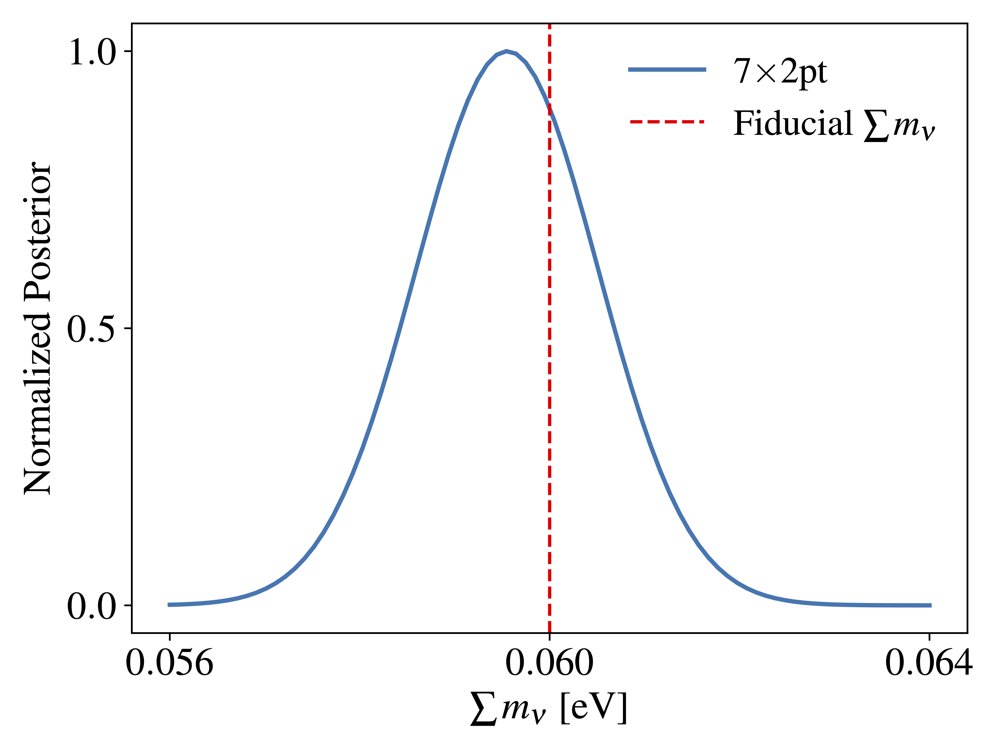

Interactive Example
===================

This section provides a simple example of how to run CLOE `interactively` 
in a Jupyter Notebook, rather than the standard approach described in the :doc:`Quick Quide <./running_cloe>`. 
We note that the standard approach is more suitable for the large-scale production of parameter inferences.

Initial Setup
-------------

In this example, let us consider CLOE interfaced with Cobaya
(noting that CLOE also has an interface with CosmoSIS, with a corresponding interactive example in ``cosmosis_validation.ipynb``).
To this end, first import the necessary libraries and modules:

.. code:: python

    import numpy as np
    from matplotlib import pyplot as plt
    import copy
    # Cobaya's model wrapper
    from cobaya.model import get_model
    # Cobaya's run method
    from cobaya.run import run
    # Interface for Euclid-like likelihoods
    from cloe.cobaya_interface import EuclidLikelihood
    # Photometric survey observables (e.g. weak lensing, galaxy clustering)
    from cloe.photometric_survey.photo import Photo
    # Spectroscopic survey observables (e.g. multipole power spectra)
    from cloe.spectroscopic_survey.spectro import Spectro
    # CMB cross-correlation observables
    from cloe.cmbx_p.cmbx import CMBX

Next, create a dictionary or YAML file as input.
The ``info`` dictionary below can be modified by the user according to their needs:

.. code:: python

    info = {
    # 'params': Cobaya-protected key
    # Includes the parameters that the user wants to sample over.
        'params': {
            # Each parameter below (which is a 'key' of another sub-dictionary)
            # can contain a dictionary with the key 'prior', 'latex', etc. If the
            # prior is not provided for a parameter, the parameter is fixed. 
            # For more information, see Cobaya's quickstart example.
            'ombh2': 0.022445, # Reduced baryon density parameter
            'omch2': 0.1205579307, # Reduced CDM density parameter
            'H0': 67.0, # Hubble constant in km/s/Mpc
            'tau': 0.0925, # Optical depth
            'mnu': 0.06, # Sum of neutrino masses in eV
            'nnu': 3.046, # Effective number of neutrinos
            'As': 2.12605e-9, # Amplitude of the primordial scalar power spectrum
            'ns': 0.96, # Spectral index
            'w': -1, # Present dark energy equation of state in CPL model
            'wa': 0, # Derivative of dark energy equation of state in CPL model
            'omk': 0.0, # Curvature density parameter
            'omegam': None, # Derived parameter: Matter density parameter
            'omegab': None, # Derived parameter: Baryon density parameter
            'omeganu': None, # Derived parameter: Neutrino density parameter
            'omnuh2': None, # Derived parameter: Reduced neutrino density parameter
            'omegac': None}, # Derived parameter: CDM density parameter
        # 'theory': Cobaya-protected key
        # Choose between CAMB or CLASS for the Boltzmann solver.
        # Here, we use CAMB and specify arguments such as
        # the number of massive neutrinos and DE model.
        'theory': {'camb':
                   {'stop_at_error': True, # 'path': 'path/to/camb',
                    'extra_args':{'num_massive_neutrinos': 1,
                                  'dark_energy_model': 'ppf'}}},
        # 'sampler': Cobaya-protected key
        # For a full MCMC sampling, can use the following line:
        # 'sampler': {'mcmc': {'max_tries': 100000}},
        # Here, use the 'evaluate' sampler to make a single likelihood evaluation. 
        'sampler': {'evaluate': None},
        # 'packages_path': Cobaya-protected key
        # Uncomment the line below if running Cobaya with cobaya_modules.
        # 'packages_path': modules_path,
        # 'output': Cobaya-protected key
        # This is where the chains are stored.
        'output': 'chains/my_euclid_experiment',
        # 'likelihood': Cobaya-protected key
        # Here, we load CLOE as an external likelihood and name it 'Euclid'.
        'likelihood': {'Euclid': EuclidLikelihood},
        # 'debug': Cobaya-protected key
        # This specifies how much information to print, can be set to True/False. 
        'debug': True,
        # 'timing': Cobaya-protected key
        # If timing: True, Cobaya returns timing information.
        'timing': True,
        # 'force': Cobaya-protected key
        # If 'force': True, past output files with the same name are deleted.
        'force': True
        }

    # Fiducial cosmology, needed at a subsequent stage below.
    fid_cosmo = copy.deepcopy(info['params'])

The dictionary above has several Cobaya-protected keys (for further details, see its `documentation <https://cobaya.readthedocs.io/en/latest/example.html>`_). These include:

- ``params``: primary or derived cosmological parameters. If sampled, the user can choose their prior, the LaTeX label in plots,
  the optional reference starting point for the chains (denoted `ref`), and the initial spread of the parameter covariance matrix (denoted `proposal`).
- ``theory``: Boltzmann solver (i.e. CAMB or CLASS) used to compute the linear matter power spectrum and background expansion.
- ``packages_path``: optional path to where external codes (e.g. CAMB, Polychord) are installed. 
- ``likelihood``: likelihood name, returns the log-likelihood given the ``params`` values.
- ``sampler``: name of the sampler to use (e.g. ``evaluate``, ``mcmc``, ``polychord``), along with addtional configurations such as the maximum number of samples 
  and the set of initial samples to discard.
- ``output``: name prefix of the Monte Carlo chains and path to where they are written.

Note that the configurations above overwrite those in ``configs/config_default.yaml``. 

Likelihood Sampling
-------------------

Once the ``info`` dictionary has been created, we can immediately proceed to sample the likelihood
via Cobaya's ``run`` method:

.. code:: python

    info_updated, sampler = run(info)

Here, the ``run`` method returns `info_updated` and `sampler`. 
The former is an info dictionary that is updated with the default configurations 
(for keys that have not already been specified by the user),
and the latter is a sampler object where sampler.products() provides a 
dictionary of the results.

By executing the cell above, we obtain the log-likelihood at the reference cosmology. Had we chosen the sampler
to be ``mcmc`` or ``polychord`` instead of ``evaluate``, there would have been a full Monte Carlo run instead
of a single likelihood evaluation.

Theory Predictions
------------------

We now take a step back to produce the theoretical predictions with CLOE.
First, let us provide further details on the likelihood itself. We again highlight
that the configurations below will overwrite those in ``configs/config_default.yaml``.
Further note that the cell below can also be executed before sampling the likelihood above.

.. code:: python

    info['likelihood'] = {'Euclid':
                         {'external': EuclidLikelihood,
                         # Select the observables to use for the analysis
                         'observables_selection': {
                             'WL': {'WL': True, 'GCphot': True, 'GCspectro': False},
                             'GCphot': {'GCphot': True, 'GCspectro': False},
                             'GCspectro': {'GCspectro': False},
                             'CMBlens': {'CMBlens':True, 'WL':True, 'GCphot':True},
                             'CMBisw': {'GCphot':True}, 'CG': {'CG': False}, 
                             'CG': {'CG': False},
                             # Add RSD to photometric probes
                             'add_phot_RSD': False,
                             # BNT transformation of photometric observables
                             'matrix_transform_phot' : False # 'BNT' or 'BNT-test'
                         },
                         # Plot the selected observables matrix
                         'plot_observables_selection': True,
                         # NL_flag_phot_matter
                             # 0 -> linear-only
                             # 1 -> Halofit (Takahashi)
                             # 2 -> Mead2016 (includes baryon corrections)
                             # 3 -> Mead2020 (w/o baryon corrections)
                             # 4 -> Euclid Emulator 2
                             # 5 -> BACCO (matter)
                         'NL_flag_phot_matter': 1,
                         # NL_flag_spectro
                             # 0 -> linear-only
                             # 1 -> EFT
                         'NL_flag_spectro': 0,
                         # Baryonic feedback flag
                             #0 -> no baryonic feedback
                             #1 -> Mead2016
                             #2 -> Mead2020_feedback
                             #3 -> BCemu
                             #4 -> BACCO (baryonic feedback)
                         'NL_flag_phot_baryon': 0,
                         # NL_flag_phot_bias
                             # 0 -> linear only
                             # 1 -> Nonlinear PT
                         'NL_flag_phot_bias': 0,
                         # IA_flag
                             # 0 -> NLA
                             # 1 -> TATT
                         'IA_flag': 1,
                         # IR-resummation method
                             # 'DST' -> Discrete sine transform
                             # 'EH' -> Eisenstein-Hu                      
                         'IR_resum': 'DST',
                         # Use magnification bias for GCspectro
                         'use_magnification_bias_spectro': 0,
                         # Baryonic feedback z_dependence flag selector for
                         # Bacco or BCemu emulators
                             # False -> 1 set of parameters per redshift bin
                             # True  -> Power-law dependence on z
                         'Baryon_redshift_model': False,
                         'solver': 'camb',
                         'params': {
                                    # Photometric galaxy bias parameters
                                    # In this example, the parameters are fixed to the values
                                    # in the Euclid forecast paper arXiv:1910.09273. However,
                                    # they can be fixed to other values or sampled by the user.
                                    'b1_photo_bin1': 1.0997727037892875,
                                    'b1_photo_bin2': 1.220245876862528,
                                    'b1_photo_bin3': 1.2723993083933989,
                                    'b1_photo_bin4': 1.316624471897739,
                                    'b1_photo_bin5': 1.35812370570578,
                                    'b1_photo_bin6': 1.3998214171814918,
                                    'b1_photo_bin7': 1.4446452851824907,
                                    'b1_photo_bin8': 1.4964959071110084,
                                    'b1_photo_bin9': 1.5652475842498528,
                                    'b1_photo_bin10': 1.7429859437184225,
                                    # Magnification bias parameters
                                    'magnification_bias_1': 0.0,
                                    'magnification_bias_2': 0.0,
                                    'magnification_bias_3': 0.0,
                                    'magnification_bias_4': 0.0,
                                    'magnification_bias_5': 0.0,
                                    'magnification_bias_6': 0.0,
                                    'magnification_bias_7': 0.0,
                                    'magnification_bias_8': 0.0,
                                    'magnification_bias_9': 0.0,
                                    'magnification_bias_10': 0.0,
                                    # Shear multiplicative bias parameters
                                    'multiplicative_bias_1': 0.0,
                                    'multiplicative_bias_2': 0.0,
                                    'multiplicative_bias_3': 0.0,
                                    'multiplicative_bias_4': 0.0,
                                    'multiplicative_bias_5': 0.0,
                                    'multiplicative_bias_6': 0.0,
                                    'multiplicative_bias_7': 0.0,
                                    'multiplicative_bias_8': 0.0,
                                    'multiplicative_bias_9': 0.0,
                                    'multiplicative_bias_10': 0.0,
                                    # Intrinsic alignment parameters
                                    'a1_ia': 1.72,
                                    'a2_ia': 2,
                                    'b1_ia': 1,
                                    'eta1_ia': -0.41,
                                    'eta2_ia': 1,
                                    'beta1_ia': 0.0,
                                    # Photometric redshift distribution shift parameters
                                    'dz_1_GCphot': 0.0, 'dz_1_WL': 0.0,
                                    'dz_2_GCphot': 0.0, 'dz_2_WL': 0.0,
                                    'dz_3_GCphot': 0.0, 'dz_3_WL': 0.0,
                                    'dz_4_GCphot': 0.0, 'dz_4_WL': 0.0,
                                    'dz_5_GCphot': 0.0, 'dz_5_WL': 0.0,
                                    'dz_6_GCphot': 0.0, 'dz_6_WL': 0.0,
                                    'dz_7_GCphot': 0.0, 'dz_7_WL': 0.0,
                                    'dz_8_GCphot': 0.0, 'dz_8_WL': 0.0,
                                    'dz_9_GCphot': 0.0, 'dz_9_WL': 0.0,
                                    'dz_10_GCphot': 0.0, 'dz_10_WL': 0.0,
                                    # 1-point redshift error dispersion (spectroscopic)
                                    'sigma_z': 0.002,
                                    # Modified gravity growth index parameter
                                    'gamma_MG': 0.55,
                                    # Spectroscopic galaxy bias parameters
                                    'b1_spectro_bin1': 1.441,
                                    'b1_spectro_bin2': 1.643,
                                    'b1_spectro_bin3': 1.862,
                                    'b1_spectro_bin4': 2.078,
                                    # Spectroscopic magnification bias
                                    'magnification_bias_spectro_bin1': 0.79,
                                    'magnification_bias_spectro_bin2': 0.87,
                                    'magnification_bias_spectro_bin3': 0.96,
                                    'magnification_bias_spectro_bin4': 0.98,},
                         # k values for matter power spectrum extrapolation and k-array size
                         'k_max_extrap': 500.0,
                         'k_min_extrap': 1E-5,
                         'k_samp': 1000,
                         # z limit values and z-array size
                         'z_min': 0.0,
                         'z_max': 4.0,
                         'z_samp': 100,
                         # Use modified gravity growth index
                         'use_gamma_MG': False,
                         # Use Weyl potential
                         'use_Weyl': False,
                         # Use redshift-dependent purity (spectroscopic)
                         'f_out_z_dep': False,
                         # Add spectroscopic redshift errors
                         'GCsp_z_err': False,
                         # Print theory predictions
                         'print_theory': False,
                         # Specify the paths of the input data files
                         'data': {
                            # 'sample' specifies the first folder below the main data folder
                            'sample': 'ExternalBenchmark',
                            # 'spectro', 'photo', and 'cmbx' specify paths to data files.
                            'spectro': {
                                # GCspectro root name should contain z{:s} string
                                # to enable iteration over bins
                                'root': 'cov_power_galaxies_dk0p004_z{:s}.fits',
                                'redshifts': ["1.", "1.2", "1.4", "1.65"],
                                'edges': [0.9, 1.1, 1.3, 1.5, 1.8],
                                'scale_cuts_fourier': 'GCspectro-FourierSpace.yaml',
                                'root_mixing_matrix': 'mm_FS230degCircle_m3_nosm_obsz_z0.9-1.1.fits',
                                'Fourier': True},
                            'photo': {
                              'photo_data': 'standard',
                                'redshifts': [0.2095, 0.489, 0.619, 0.7335, 0.8445, 0.9595, 1.087, 1.2395, 1.45, 2.038],
                                'ndens_GC': 'niTab-EP10-RB00.dat',
                                'ndens_WL': 'niTab-EP10-RB00.dat',
                                'luminosity_ratio': 'luminosity_ratio.dat',
                                # Photometric root names should contain z{:s} string
                                # to specify IA model
                                'root_GC': 'Cls_{:s}_PosPos.dat',
                                'root_WL': 'Cls_{:s}_ShearShear.dat',
                                'root_XC': 'Cls_{:s}_PosShear.dat',
                                'root_mixing_matrix': 'fs2_mms_10zbins_32ellbins.fits',
                                'IA_model': 'zNLA',
                                # Photometric covariances root names should contain z{:s}
                                # string to specify how the covariance was calculated
                                'cov_GC': 'CovMat-PosPos-{:s}-20Bins.npz',
                                'cov_WL': 'CovMat-ShearShear-{:s}-20Bins.npz',
                                'cov_3x2pt': 'CovMat-3x2pt-{:s}-20Bins.npz',
                                'cov_model': 'Gauss',  # 'BNT-Gauss' if BNT selected above
                                'Fourier': True
                                },
                            'cmbx': {
                                  'root_CMBlens': 'Cls_kCMB.dat',
                                  'root_CMBlensxWL': 'Cls_kCMBxWL.dat',
                                  'root_CMBlensxGC': 'Cls_kCMBxGC.dat',
                                  'root_CMBisw': 'Cls_{:s}_ISWxGC.dat',
                                  'ISW_model': 'zNLA',
                                  'cov_7x2pt': 'Cov_7x2pt_WL_GC_CMBX.npy'}}
                        }}

Let us now consider a uniform prior on the sum of neutrino masses from 0 to 1 eV.
Further, utilize the ``model`` wrapper in Cobaya to obtain the log probabilities:

.. code:: python
    
    info['params']['mnu'] = {"prior": {"min": 0., "max": 1.}}
    model = get_model(info)
    logposterior = model.logposterior([fid_cosmo['mnu']])
    like = model.likelihood['Euclid']

Next, let us create an instance of the ``Photo`` class in CLOE
given the cosmology dictionary and photometric redshift distributions:
    
.. code:: python

    photo = Photo(like.cosmo.cosmo_dic, like.likefinal.data_ins.nz_dict_WL, like.likefinal.data_ins.nz_dict_GC_Phot)

This allows us to use the ``Cl_WL`` method in ``Photo`` to make a plot of the convergence power spectrum 
for a select combination of tomographic bins:
    
.. code:: python

    plt.figure(figsize=(9, 6))
    
    lmin = 2; lmax = 3000
    ells = np.geomspace(lmin, lmax, num=100)
    
    # Rescaling factor
    factor = ells * (ells + 1) / (2 * np.pi)
    
    # Colormap for distinct, modern colors
    colors = plt.cm.viridis(np.linspace(0.2, 0.8, 5))
    
    # Auto-bin pairs: 2, 4, 6, 8, 10
    for idx, i in enumerate([2, 4, 6, 8, 10]):
        cl_kk = photo.Cl_WL(ells, i, i)
        cl_kk_scaled = cl_kk * factor
        plt.loglog(ells, cl_kk_scaled, label=fr'$C_\ell^{{\kappa_{{{i}}} \kappa_{{{i}}}}}$', 
                   lw=2.2, color=colors[idx])
    
    # Axis labels & title
    plt.xlabel(r'$\ell$', fontsize=18)
    plt.ylabel(r'$\frac{\ell(\ell+1)}{2\pi} C_\ell^{\kappa\kappa}$', fontsize=18)
    plt.title('Convergence Power Spectrum', fontsize=20)
    
    # Ticks
    plt.xticks(fontsize=14)
    plt.yticks(fontsize=14)
    
    # Grid for visual polish
    plt.grid(True, which='both', linestyle='--', linewidth=0.5, alpha=0.5)
    
    # Legend
    plt.legend(fontsize=14, frameon=True, framealpha=0.8, edgecolor='gray')
    
    plt.tight_layout()
    plt.savefig("lensingplot.png", dpi=300)
    plt.show()

.. image:: ../other/lensingplot.png
  :width: 670
  :alt: Lensingplot

Analogously, we can make a plot of the photometric galaxy power spectrum for the same
combination of tomographic bins through the ``Cl_GC_phot`` method in ``Photo``:

.. code:: python
    
    plt.figure(figsize=(9, 6))
    
    factor = ells * (ells + 1) / (2 * np.pi)
    colors = plt.cm.plasma(np.linspace(0.2, 0.8, 5))
    
    for idx, i in enumerate([2, 4, 6, 8, 10]):
        cl_gc = photo.Cl_GC_phot(ells, i, i)
        cl_gc_scaled = cl_gc * factor
        plt.loglog(ells, cl_gc_scaled, label=fr'$C_\ell^{{g_{{{i}}} g_{{{i}}}}}$', 
                   lw=2.2, color=colors[idx])
    
    plt.xlabel(r'$\ell$', fontsize=18)
    plt.ylabel(r'$\frac{\ell(\ell+1)}{2\pi} C_\ell^{gg}$', fontsize=18)
    plt.title('Photometric Galaxy Power Spectrum', fontsize=20)
    
    plt.xticks(fontsize=14)
    plt.yticks(fontsize=14)
    plt.grid(True, which='both', linestyle='--', linewidth=0.5, alpha=0.5)
    
    plt.legend(fontsize=14, frameon=True, framealpha=0.8, edgecolor='gray')
    plt.tight_layout()
    plt.savefig("galaxyplot.png", dpi=300)
    plt.show()

.. image:: ../other/galaxyplot.png
  :width: 670
  :alt: Galaxyplot

Let us now create an instance of the ``Spectro`` class in CLOE
given the cosmology dictionary and set of spectroscopic redshifts:

.. code:: python

    spectro = Spectro(like.cosmo.cosmo_dic, info['likelihood']['Euclid']['data']['spectro']['redshifts'])

This allows us to use the ``multipole_spectra`` method in ``Spectro`` to  make a plot of the redshift-space 
multipole power spectrum (monopole, quadrupole, hexadecapole) as a function of wavenumber and redshift:

.. code:: python
    
    plt.figure(figsize=(9, 6))
    
    k_vals = np.logspace(-3, 0, 100)
    redshifts = [1.0, 1.65]
    multipoles = [0, 2, 4]
    colors = plt.cm.viridis(np.linspace(0.2, 0.8, len(multipoles)))
    linestyles = ['-', '--']
    
    for z_idx, z in enumerate(redshifts):
        for m_idx, m in enumerate(multipoles):
            # For each k, call multipole_spectra with scalar k and ms=[m]
            spectra = np.array([spectro.multipole_spectra(z, k, ms=[m])[0] for k in k_vals])
            label = fr'$z={z:.2f}, \, m={m}$'
            plt.loglog(k_vals, spectra, label=label,
                       color=colors[m_idx], linestyle=linestyles[z_idx], lw=2)
    
    plt.xlabel(r'$k \; [h/\mathrm{Mpc}]$', fontsize=18)
    plt.ylabel(r'$P_m(k,z)$', fontsize=18)
    plt.title('Multipole Power Spectra', fontsize=20)
    
    plt.xticks(fontsize=14)
    plt.yticks(fontsize=14)
    plt.grid(True, which='both', linestyle='--', alpha=0.5)
    
    plt.legend(fontsize=14, frameon=True, framealpha=0.8, edgecolor='gray', ncol=2)
    plt.tight_layout()
    plt.savefig("multipole_spectra_plot.png", dpi=300)
    plt.show()

.. image:: ../other/multipole_spectra_plot.png
  :width: 670
  :alt: Multipoleplot

Lastly, let us illustrate the cross-correlation between different tracers by
first creating an instance of the ``CMBX`` class in CLOE:

.. code:: python
    
    cmbx = CMBX(photo)
    cmbx.cmbx_update(photo)

As an example, by utilizing the method ``Cl_kCMB_X_GC_phot`` in ``CMBX``,
we can make a plot of the cross-correlation between photometric galaxy positions and CMB lensing:

.. code:: python
    
    plt.figure(figsize=(9, 6))
    
    factor = ells * (ells + 1) / (2 * np.pi)
    colors = plt.cm.plasma(np.linspace(0.2, 0.8, 5))
    
    for idx, i in enumerate([2, 4, 6, 8, 10]):
        cl_cross = cmbx.Cl_kCMB_X_GC_phot(ells, i)
        cl_cross_scaled = cl_cross * factor
        plt.loglog(ells, cl_cross_scaled, label=fr'$C_\ell^{{g_{{{i}}} \kappa_\mathrm{{CMB}}}}$', 
                   lw=2.2, color=colors[idx])
    
    plt.xlabel(r'$\ell$', fontsize=18)
    plt.ylabel(r'$\frac{\ell(\ell+1)}{2\pi} C_\ell^{g \kappa_\mathrm{CMB}}$', fontsize=18)
    plt.title('Photometric Galaxy × CMB Lensing Power Spectrum', fontsize=20)
    
    plt.xticks(fontsize=14)
    plt.yticks(fontsize=14)
    plt.grid(True, which='both', linestyle='--', linewidth=0.5, alpha=0.5)
    
    plt.legend(fontsize=14, frameon=True, framealpha=0.8, edgecolor='gray')
    plt.tight_layout()
    plt.savefig("cmblensing_galaxy_crossplot.png", dpi=300)
    plt.show()

.. image:: ../other/cmblensing_galaxy_crossplot.png
  :width: 670
  :alt: CMBXplot

As described in the :doc:`CLOE papers <./cite_us>` and set of features listed in the :doc:`overview section <./about>`,
it is possible to compute the theoretical predictions for a variety of other user configurations, such as the choice
of probes, summary statistics, cosmological models, and treatment of systematic uncertainties.

Parameter Posterior
-------------------

We now proceed to create a simple one-dimensional posterior with CLOE.
Here, we consider the photometric 3×2pt observables of weak gravitational lensing, 
photometric galaxy clustering, and galaxy-galaxy lensing (GG, Gg, gg) along with the 
cross-correlations of galaxy positions and shapes with the CMB lensing
potential and temperature (Gϕ, Lϕ, ϕϕ, GT) in a 7×2pt configuration.

To this end, we begin by updating the nonlinear flag for the 
matter power spectrum modeling in accordance with the synthetic data
considered. This requires us to employ the ``model`` wrapper once
more to obtain the log probabilities:

.. code:: python

    info['likelihood']['Euclid']['NL_flag_phot_matter'] = 0
    model = get_model(info)
    logposterior = model.logposterior([fid_cosmo['mnu']])
    like = model.likelihood['Euclid']

We can now construct the 1D posterior for the sum of neutrino masses.
The probes considered are those set to True in `observables_selection`
in the ``info`` dictionary, in this case corresponding to the 7×2pt scenario:
    
.. code:: python

    mnu = np.linspace(0.056, 0.064, num=80)
    log = np.zeros_like(mnu)
    for i, m in enumerate(mnu):
        log[i] = model.logposterior([m]).loglikes[0]

This allows us to make a plot of the posterior probability:

.. code:: python
    
    plt.plot(mnu, np.exp(log)/np.max(np.exp(log)), label="7$\\times$2pt", lw=2)
    plt.axvline(x=0.06, color='r', linestyle='--', label="Fiducial $\sum m_\\nu$")
    
    # Axis labels
    plt.xlabel(r"$\sum m_\nu$ [eV]", fontsize=18)
    plt.ylabel("Normalized Posterior", fontsize=18)
    
    # Customize ticks
    plt.xticks(np.linspace(min(mnu), max(mnu), 3), fontsize=18)
    plt.yticks(np.linspace(0, 1, 3), fontsize=18)
    
    # Legend in upper right corner
    plt.legend(fontsize=17, loc='upper right', frameon=False)
    
    plt.tight_layout()
    
    plt.savefig("neutrinoplot.png")
    plt.show()

For a detailed breakdown of how to run CLOE in this and other ways, see the demoonstration and 
validation Jupyter Notebooks in the ``notebooks`` directory of the CLOE repository.
            

