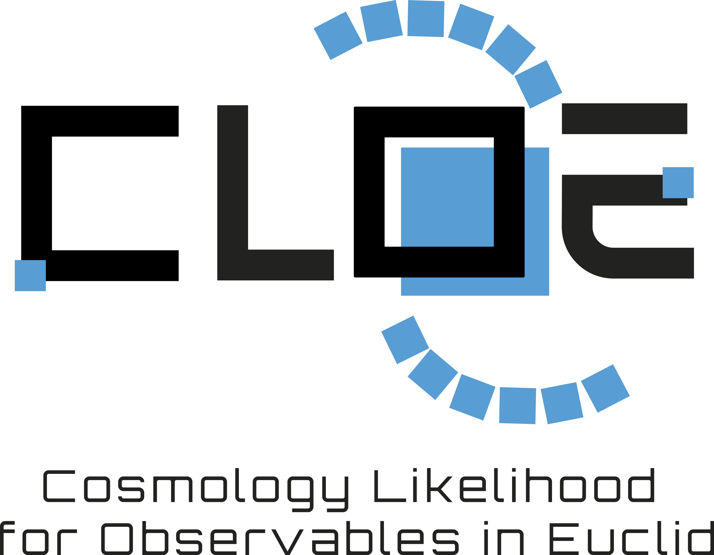

Cosmology Likelihood for Observables in Euclid
==============================================

The Cosmology Likelihood for Observables in Euclid (CLOE) is a validated analysis package
developed by members of the Euclid Consortium. It is a modular Python code for computing the
theoretical predictions of cosmological observables and evaluating them against state-of-the-art
data from galaxy surveys such as Euclid in a unified likelihood. This primarily includes the core
observables of weak gravitational lensing, photometric galaxy clustering, galaxy-galaxy lensing,
and spectroscopic galaxy clustering, but also extended probes such as the clusters of galaxies and 
cross-correlations of galaxy positions and shapes with the cosmic microwave background. 

.. note::

    While CLOE has been developed to serve as the unified framework for the parameter inferences in Euclid, it has
    general capabilities that can serve the broader cosmological community. It is different from other 
    comparable cosmological tools in that it is written entirely in Python, performs the full likelihood 
    calculation, and includes both photometric and spectroscopic observables. 

.. toctree::
   :maxdepth: 2
   :caption: Getting Started
   :name: getting_started

   Overview<about.rst>
   Installation<installation.rst>
   Quick Guide<running_cloe.rst>

.. toctree::
   :maxdepth: 1
   :caption: Cookbook
   :name: cookbook

   Interactive Example<example.rst>

.. toctree::
   :maxdepth: 1
   :caption: Reference
   :name: apiref

   API Documentation<cloe>
   Citing CLOE<cite_us.rst>
   Changelog<changelog.rst>
   Contributing<contributing.rst>
